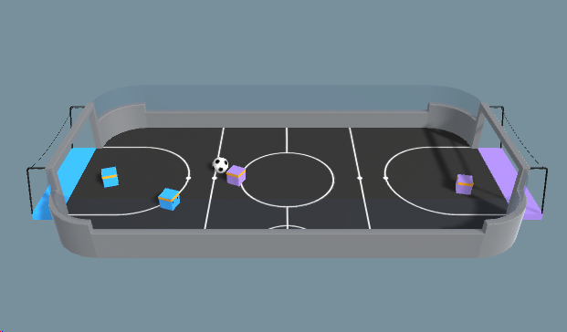

# Football RL Striker Agents - Reinforcement Learning in Unity Football Environment

This project is a Reinforcement Learning (RL) agent trained to play football (soccer) in the Unity Football Environment. The agent is trained using the Unity ML-Agents library with Gymnasium integration.

Given below are the details of the environment and agent
- Set-up: Environment where four agents compete in a 2 vs 2 toy soccer game.
- Goal:
Get the ball into the opponent's goal while preventing the ball from entering own goal.
- Agents: The environment contains two different Multi Agent Groups with two agents in each. Parameters : SoccerTwos.
Agent Reward Function (dependent):
  - (1 - accumulated time penalty) When ball enters opponent's goal accumulated time penalty is incremented by (1 / MaxStep) every fixed update and is reset to 0 at the beginning of an episode.
  - -1 When ball enters team's goal.
- Behavior Parameters:
  - Vector Observation space: 336 corresponding to 11 ray-casts forward distributed over 120 degrees and 3 ray-casts backward distributed over 90 degrees each detecting 6 possible object types, along with the object's distance. The forward ray-casts contribute 264 state dimensions and backward 72 state dimensions over three observation stacks.
  - Actions: 3 discrete branched actions corresponding to forward, backward, sideways movement, as well as rotation.
  - Visual Observations: None



## Requirements

Before running the project, ensure you have the following dependencies installed:

- Python 3.8+
- Unity
- Unity ML-Agents Library (`mlagents`)


use a virtual environment (suggested)
```sh
venv footballenv
source footballenv/bin/activate
```
Install the dependencies using:
```sh
pip install -r requirements.txt
```

## Running the Unity Football Environment

1. Download and install Unity Hub and Unity Editor.
2. Install ml-agents library ([instructions](https://unity-technologies.github.io/ml-agents/Installation/))
3. Open the project in Unity and load the scene using `Assets/Football-Agent/Agent/Football/Scenes/SoccerTwos.unity`.
4. Click on `Assets/Football-Agent/Agent/Football/Prefabs/SoccerFieldTwos.prefab` and add `Assets/Football-Agent/Agent/Football/Scripts/AgentSoccer.cs` into behaviour script (right panel).
5. In the same section (right panel) load the model that you trained (or use `Assets/Football-Agent/Agent/Football/TFModels/SoccerTwos.onnx`).

## Training the RL Agent

1. Navigate to the project directory where the RL training script is located.
2. Run the training script using:
   ```sh
   mlagents-learn ./FootballTwos.yaml --run-id=training_id
   ```
3. You can view the training data after training using
   ```sh
   tensorboard --logdir results
   ```

results are stored in `results/training_id`


## Customization
- Modify env and agent scripts in `Assets/Football-Agent/Agent/Football/Scripts/` to adjust hyperparameters like learning rate, batch size, and training episodes.
- Modify hyperparameters in config file in scripts folder as given above (`FootballTwos.yaml`). 


## References
- Unity ML-Agents: [https://unity-technologies.github.io/ml-agents/](https://unity-technologies.github.io/ml-agents/)
- Gymnasium: [https://gymnasium.farama.org](https://gymnasium.farama.org)
